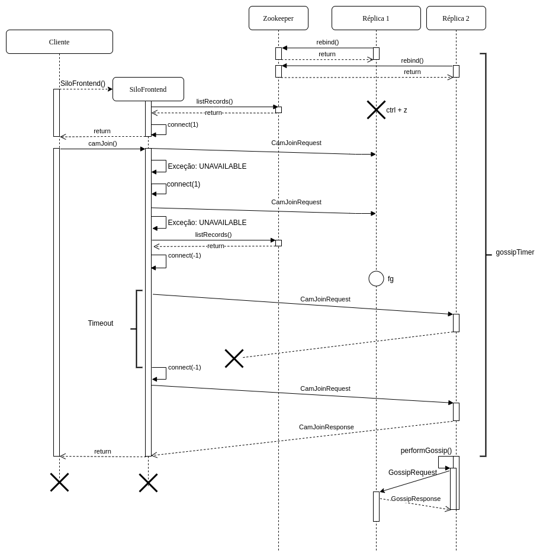

# Relatório do projeto Sauron

Sistemas Distribuídos 2019-2020, segundo semestre

## Autores

**Grupo A20**

| Número | Nome              | Utilizador                              | Correio eletrónico                                                 |
| -------|-------------------|-----------------------------------------| -------------------------------------------------------------------|
| 89403  | Alexandre Duarte  | <https://github.com/alexduarte23>       | <mailto:alexandre.a.duarte@tecnico.ulisboa.pt>                     |
| 89426  | Daniel Lopes      | <https://github.com/DFL13>              | <mailto:daniel.f.lopes@tecnico.ulisboa.pt>                         |
| 89504  | Mariana Oliveira  | <https://github.com/tpoliveira-mariana> | <mailto:mariana.de.oliveira@tecnico.ulisboa.pt@tecnico.ulisboa.pt> |

  

## Melhorias da primeira parte

- [Adição de testes ao comando trace](https://github.com/tecnico-distsys/A20-Sauron/commit/bca534e2c7fd1d997ff14e00fad5211b07dcbcf0)
- [Adição de testes ao comando cam_join](https://github.com/tecnico-distsys/A20-Sauron/commit/ff15d99e0141b82c9fd22776e5f24157cc2fc2c7)
- [Formatação de output removida do SiloFrontend](https://github.com/tecnico-distsys/A20-Sauron/commit/5eefeb7a9514c07af7c8fd3438820cded4ec55c9)

## Modelo de faltas
Considerem-se os pressupostos do enunciado.
Seja _f_ o número de faltas a tolerar, então são necessárias, no mínimo, _f + 1_ réplicas.
Desde que haja uma réplica funcional, o cliente consegue sempre ligar-se a ela e enviar
os seus pedido. 

##### Faltas toleradas:
1. Falta do cliente;
2. Omissão de mensagens por parte dos canais de comunicação;
3. Partições da rede;
4. _Crash_ que não leve a perda de informação (ctrl + z, por exemplo); 

##### Faltas não toleradas:
1. _Crash_ de réplicas que leve à perda da sua informação;
3. Falta do Zookeeper.

## Solução

Como representado no diagrama, o nosso sistema permite tolerar várias faltas.

* **Faltas do cliente** - Não infuenciam o funcionamento das réplicas.

* **Omissão de mensagens / Partição da rede** - Quando inicia, o cliente estabelece
uma conexão com uma réplica (neste exemplo, a 1). Depois de tal facto, 1 _crasha_.
O cliente executa um _camJoin()_, que resulta no envio de um _CamJoinRequest_ à réplica 1.
No entanto, como esta não está ativa, é lançada uma exceção (_UNAVAILABLE_). O cliente
volta a conectar-se a 1, que ainda está registada no servidor de nomes, e reenvia o
pedido, voltanto a ser lançada a mesma exceção. Depois desta segunda tentativa, o 
cliente conecta-se à réplica 2 (escolhida aleatoriamente) e, mais uma vez, envia o 
_CamJoinRequest_. Dada a perda da _CamJoinResponse_, um _timeout_ no cliente faz com que 
o cliente se reconecte a uma réplica escolhida aleatoriamente e reenvie o pedido. 
Desta vez o cliente recebe a resposta, a falta foi tolerada.

* **_Crash_ de réplicas sem perda de informação** - Considerando que a réplica 1 não
perdeu a informação que tinha antes de ter _crashado_, então, quando volta a ficar ativa,
eventualmente, recebe _gossip_ de outras réplicas, o que lhe permite atualizar-se. A falta
foi tolerada.

## Protocolo de replicação

Para realizar a replicação de dados entre réplicas seguimos a seguinte variante do protocolo _Gossip_:
Estruturas:
  - _Record_: contém o pedido de update, opId único da operação, prevTS, updateTS, réplica e data-hora da primeira receção.
  - _Log_: contém _records_ de camJoins e reports ainda não conhecidos por todas as réplicas.

Envio:
  - Quando um servidor é lançado inicia-se um temporizador, que cada _X_ tempo aciona a 
  tarefa de replicação.
  - Havendo mais que uma réplica disponível no registo de nomes é aleatoriamente selecionado 
  uma réplica à qual se irá enviar uma mensagem _Gossip_.
  - Define-se no envio da mensagem um tempo de timeout aleatório para prevenir que réplicas 
  fiquem 'presas' por estarem simultaneamente a tentar enviar mensagem uma para a outra.
  - Caso ocorra timeout no envio ou a réplica se encontre indisponível é escolhida outra 
  réplica, uma vez que se tenha tentado enviar, sem sucesso, para todas as réplicas disponíveis 
  a tarefa é abortada, sendo novamente iniciada no próximo evento do temporizador.
  - Sendo bem-sucedido a réplica recetora recebe uma mensagem contendo:
    - Número da réplica transmissora
    - _replicaTS_
    - _Records_ do _log_ que se presume não existirem na réplica recetora
  
Receção:
  - A réplica recetora envia primeiro a resposta para que a transmissora receba o mais rapidamente 
  possível a informação de sucesso, e procede ao tratamento a mensagem _Gossip_ recebida
  - O vetor _replicaTS_ é atualizado com o _replicaTS_ recebido na mensagem
  - A entrada da _tableTS_ referente à réplica transmissora é atualizada para guardar o _replicaTS_ recebido.
  - Os _records_ recebidos são analisados para determinar se devem ser adicionados ao _log_:
    - Se o estado/versão da réplica transmissora presente no record for superior ao conhecido 
    então corresponde a um update ainda não conhecido.
    - Se o _opId_ do update não for igual a nenhum _opId_ de um _record_ no _log_ então o pedido 
    não é duplicado e o _record_ pode ser adicionado ao _log_.
    - Se o duplicado for um _ReportRequest_ então a data-hora é unificada com a do pedido no _log_:
      - Se o _report_ já tiver sido aplicado ao _value_ então as observações correspondestes são 
      atualizadas para manter a data-hora menor.
      - Se ainda não tiver sido aplicado basta atualizar a data-hora do _record_ presente no _log_.
  - Aplica-se ao _value_ os _updates_ no _log_ que satisfazem a condição de estabilidade.
  - Elimina-se os _records_ que já tenham sido aplicados ao _value_ e que já tenham sido 
  transmitidos por _Gossip_ às restantes réplicas, nomeadamente se a versão da réplica 
  transmissora do record presente no _updateTS_ deste for inferior ao valor guardado na _tableTS_.

## Opções de implementação

Considerando que o gossip não pretende garantir a coerência do ponto de vista do cliente,
decidimos que implementar uma _cache_ no mesmo seria uma solução eficaz. Desta forma, o 
cliente, que passou também a guardar o _timestamp_ da última versão do servidor vista
(_prevTS_), consegue escolher entre descartar ou não cada resposta do servidor aos seus
pedidos de leitura. Basta verificar se _prevTS_ é superior ao _timestamp_ da resposta
recebida.

Considere-se, agora, a situação em que um cliente faz um report para a réplica _A_, que o 
recebe. De seguida, _A_ atribui um _timestamp_ X às observações e envia uma ReportResponse 
ao cliente. Se esta resposta não chegar ao cliente (ou chegar, mas só depois de ter
ocorrido um timeout), o cliente reenvia o pedido para _A_. Desta vez, o pedido perde-se
na rede, pelo que volta a ocorrer um _timeout_ no cliente. Depois deste segundo _timeout_
o cliente envia o mesmo pedido para a réplica _B_. _B_ recebe-o, atribui um
_timestamp_ Y às observações e envia a resposta para o cliente, que a recebe.

Da situação anteriormente descrita resulta que duas réplica diferentes guardem uma mesma
observação com _timestamps_ diferentes. Para evitar esta situação de incoerência, decidimos
atribuir um _id_ único a cada operação de update. Desta forma, quando, pelo gossip, uma
réplica receber um mesmo _report_ com observações que tenham _timestamp_ diferente do
seu, atualiza-o por forma a ficar com o mais antigo.

## Notas finais

Relativamente à recuperação de faltas por _crash_ de réplicas, pensámos em possíveis 
soluções, que decidimos não implementar. Considere-se que há mais do que uma réplica 
em funcionamento, até ao momento em que a réplica A _crasha_.

**Solução 1:**

Quando A volta a ficar disponível, eventualmente, recebe gossip de outras réplicas. 
Quando tal acontece, comparando o seu _replicaTS_ com o _updateTS_ do gossip recebido,
apercebe-se que perdeu informação (a sua entrada do _replicaTS_ vai ter um valor inferior 
ao presente na entrada respetiva do _replicaTS_).
Apercebendo-se de que perdeu informação, A pede a uma das outras réplicas que lhe envie os
seus mapas (com o registo das cameras e das observações). Supondo que B recebe este 
pedido, B envia a A uma mensagem gRPC com **todos os mapas e a sua versão atual**. Desta
forma A fica na mesma versão que B.

**Problema:**

As mensagens do gRPC têm limite de tamanho, logo, se a informação de uma réplica ocupar 
memória superior a este valor (o que é bastante provável) o envio falha. Assim, pode dar-se
o caso de pedidos de _cam_join_ que as outras réplicas já tenham retirado dos seus _logs_
não sejam partilhados com A. Desta forma, todos os _reports_ feitos por essa camera que
cheguem a A vão acumular-se no _log_. Este acumular de pedidos acabará provocar um novo 
_crash_ de A por falta de memória. É um ciclo vicioso.

**Solução 1.1:**

Em vez de enviar todos os mapas numa só mensagem de gRPC, **envia apenas fragmentos** dos 
mesmos em cada mensagem, até que tudo tenha sido enviado.

**Problema:**

Entre mensagens, a réplica que está a enviar os seus mapas pode receber um pedido de
update de um cliente, que pode levar ao update da sua versão. Neste caso, qual a versão
a atribuir à réplica A? Podíamos sempre impedir updates durante o processo de recuperação
de uma réplica (tanto na que envia os mapas como na que os recebe). No entanto, considerando
que os mapas podem ser gigantes e que as mensagens se podem perder, tal processo poderia
demorar muito tempo. Por esta razão, optámos por não implementar este mecanismo.